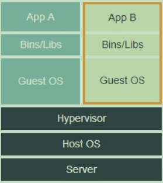

#  Docker学习

## 一、为什么要使用docker

1. 更高效的利用系统资源
2. 更快的启动速度
3. 一致的运行环境
4. 持续交付和部署
5. 更轻松的迁移、维护和扩展

**docker的优点**

1. 轻量级：所有容器在一台机器上共享同一个操作系统内核，


**docker与虚拟机的区别**

容器与虚拟机有着类似的资源隔离和分配的优点，但不同的架构方法使容器能够更加便携，高效等。

虚拟机：虚拟机在本质上就是在模拟一台真实的计算机设备，每个虚拟机都包括应用程序、必要的二进制文件和库以及一个完整的客户操作系统(Guest OS)，尽管它们被分离，它们共享并利用主机的硬件资源，将近需要十几个 GB 的大小。虚拟机架构如下图所示：



docker：容器包括应用程序及其所有的依赖，但与其他容器共享内核。它们以独立的用户空间进程形式运行在主机操作系统上。docker架构如下图所示：


## Docker Engine

Docker Engine属于Docker的运行层。这是一套轻量化运行时及工具组合，负责管理容器、镜像、构建 等等。它以原生方式运行在Linux系统之上，并由以下元素构成：

- Docker Daemon，运行在主机计算机之上。
- Docker Client，负责与Docker Daemon通信以执行命令。
- REST API，用于同Docker Daemon远程交互。

**Docker Daemon**

Docker Daemon运行在主机设备之上，但作为用户，我们永远不会直接与该Daemon进行通信。Docker Client也可以运行在主机设备上，但并非必需。它亦能够运行在另一台设备上，并与运行在目标主机上的Docker Daemon进行远程通信。

**Docker Client**

Docker Client是我们作为最终用户的通信对象。我们可以将其视为Docker的UI。

我们进行的一切操作都将直接接入Docker Client，再由其将指令传递至Docker Daemon。

**REST API**

用于同Docker Daemon远程交互。


## docker 部署架构

Docker 使用客户端-服务器 (C/S) 架构模式，使用远程API来管理和创建Docker容器。Docker 容器通过 Docker 镜像来创建。


**专有名词**

|                       |                                                              |
| --------------------- | ------------------------------------------------------------ |
| Docker镜像(Images)    | 用于创建docker容器的模板                                     |
| Docker容器(Container) | 是独立运行的一个或一组应用                                   |
| Docker客户端(Client)  | 通过命令行或其它工具使用Docker API与docker的守护进程通信     |
| Docker主机(Host)      | 一个物理的或虚拟的机器用于执行docker守护进程和容器           |
| Docker仓库(Registry)  | 用来保存镜像                                                 |
| Docker Machine        | 是一个简化Docker安装的命令行工具，通过一个简单的命令行即可在相应的平台上安装Docker |

其中：

**Docker镜像**是一个只读的模板。包含了容器运行时所需要的文件系统和一些参数。镜像是无状态的，也不会改变。镜像是用来创建容器的。你以使用docker pull命令获取一个别人已创建好的镜像，或者使用docker build来构建一个自己的镜像。

**Docker容器**就像是一个文件夹，容器中包含了应用运行所需的一切。每个容器都是一个隔离的和安全的应用平台。容器是镜像的一个实例，它是有状态的，而且随时会改变，容器一般是短暂的。

## Docker 安装

1. 先卸载可能使用的版本：`sudo apt-get remove docker docker-engine docker-ce docker.io`

2. 升级包：sudo apt-get update

3. `sudo apt-get install apt-transport-https  ca-certificates  curl  software-properties-common  `

4. `curl -fsSL https://download.docker.com/linux/ubuntu/gpg | sudo apt-key add -`

5. > sudo add-apt-repository \
   > "deb [arch=amd64] https://download.docker.com/linux/ubuntu \
   > $(lsb_release -cs) \
   > stable"

6. sudo apt update

7. sudo apt-get install docker-ce

## docker基本概念

### 镜像

docker镜像是一个特殊的文件系统

镜像构建时，会一层层构建，前一层是后一层的基础。每一层构建完就不会再发生改变，后一层上的任何改变只发生在自己这一层。

分层存储的特征还使得镜像的复用、定制变的更为容易。甚至可以用之前构建好的镜像作为基础层，然后进一步添加新的层，以定制自己所需的内容，构建新的镜像。

### 容器

容器的实质是进程，但与直接在宿主执行的进程不同，容器进程运行于属于自己的独立的 [命名空间](https://en.wikipedia.org/wiki/Linux_namespaces)。因此容器可以拥有自己的 `root` 文件系统、自己的网络配置、自己的进程空间，甚至自己的用户 ID 空间。

镜像使用的是分层存储，容器也是如此。每一个容器运行时，是以镜像为基础层，在其上创建一个当前容器的存储层，这个为容器运行时读写而准备的存储层为 **容器存储层**。

容器存储层的生存周期和容器一样，容器消亡时，容器存储层也随之消亡。因此，任何保存于容器存储层的信息都会随容器删除而丢失。数据卷的生存周期独立于容器，容器消亡，数据卷不会消亡。因此，使用数据卷后，容器删除或者重新运行之后，数据却不会丢失。

### 仓库

一个 **Docker Registry** 中可以包含多个 **仓库**（`Repository`）；每个仓库可以包含多个 **标签**（`Tag`）；每个标签对应一个镜像。

# Docker使用

## Docker Hello World

**1. 在容器内运行一个应用程序。**

```
$docker run ubuntu:15.10 /bin/echo "Hello world"
```

参数解析：

`run`：运行容器

`ubuntu:15.10`：指定要运行的镜像，Docker首先从本地主机上查找镜像是否存在，如果不存在，Docker 就会从镜像仓库 Docker Hub 下载公共镜像。

`/bin/echo "Hello world"`：在启动的容器里执行的命令

运行起来就是：Docker 以 ubuntu15.10 镜像创建一个新容器，然后在容器里执行 bin/echo "Hello world"，然后输出结果。

用 `docker run` 来创建容器时，Docker 在后台运行的标准操作包括：

- 检查本地是否存在指定的镜像，不存在就从公有仓库下载
- 利用镜像创建并启动一个容器
- 分配一个文件系统，并在只读的镜像层外面挂载一层可读写层
- 从宿主主机配置的网桥接口中桥接一个虚拟接口到容器中去
- 从地址池配置一个 ip 地址给容器
- 执行用户指定的应用程序
- 执行完毕后容器被终止

**2. 与容器进行“交互”**

```
runoob@runoob:~$ docker run -i -t --rm ubuntu:15.10 /bin/bash
root@dc0050c79503:/#
```

参数解析：

`-i`：允许对容器内的标准输入(STDIN)进行交互

`-t`：在新容器内指定一个伪终端或终端。

`-rm`：容器退出后将其删除。

**3. 启动容器**

```
runoob@runoob:~$ docker run -d ubuntu:15.10 /bin/sh -c "while true; do echo hello world; sleep 1; done"
2b1b7a428627c51ab8810d541d759f072b4fc75487eed05812646b8534a2fe63

//在输出中，并不是"hello world"，而是一长串字符串
```

输出的一长串字符串叫做**容器ID**。这个ID对每个容器来说都是唯一的，可以通过对应的ID来查看容器内发生了什么

`docker ps`：查看在运行的容器

`docker logs $容器ID/$容器名`：查看容器内的标准输出

`docker  stop $容器ID/$容器名 `：停止容器

## Docker 容器使用

运行一个web程序：在docker容器中运行一个 Python Flask 应用来运行一个web应用。

```
runoob@runoob:~# docker pull training/webapp  # 载入镜像
runoob@runoob:~# docker run -d -P training/webapp python app.py
```

`-d`：让容器在后台运行。

`-P`：大p，将容器内部使用的网络端口映射到我们使用的主机上。

`-p`：小p，指定本地主机的映射端口

```
runoob@runoob:~#  docker ps
CONTAINER ID        IMAGE               COMMAND             ...        PORTS                 
d3d5e39ed9d3        training/webapp     "python app.py"     ...        0.0.0.0:32769->5000/tcp
```

`docker port xxx`：查看指定容器的某个确定端口映射到宿主机的端口号。

`docker top xxx`：查看容器内部运行的进程

`docker inspect xxx `：查看 Docker 的底层信息。它会返回一个 JSON 文件记录着 Docker 容器的配置和状态信息。

`docker container stop`：终止容器

`docker container start`：启动已暂停的容器

`docker container restart`：重启容器

`docker exec -it <id> bash`：进入容器，从容器退出后不会导致容器暂停

`docker export <id> > xxxx.tar`：容器导出

`docker import`：导入容器	

```bash
$ cat ubuntu.tar | docker import - test/ubuntu:v1.0
$ docker image ls
REPOSITORY          TAG                 IMAGE ID            CREATED              VIRTUAL SIZE
test/ubuntu         v1.0                9d37a6082e97        About a minute ago   171.3 MB

$ docker import http://example.com/exampleimage.tgz example/imagerepo
```

`docker container rm <id>`：删除处于终止状态的容器

`docker container prune`：删除所有处于终止状态的容器。

<<<<<<< HEAD:programLanguage/go/docker/docker 使用.md


## Docker镜像使用

**获取镜像**

` docker pull [选项] [Docker Registry 地址[:端口号]/]仓库名[:标签]`

比如：`docker pull ubuntu:18.04`


当运行容器时，使用的镜像如果在本地中不存在，docker 就会自动从 docker 镜像仓库中下载，默认是从 Docker Hub 公共镜像源下载。

```
runoob@runoob:~$ docker images           
REPOSITORY          TAG                 IMAGE ID            CREATED             SIZE
ubuntu              14.04               90d5884b1ee0        5 days ago          188 MB
php                 5.6                 f40e9e0f10c8        9 days ago          444.8 MB
nginx               latest              6f8d099c3adc        12 days ago         182.7 MB
mysql               5.6                 f2e8d6c772c0        3 weeks ago         324.6 MB
httpd               latest              02ef73cf1bc0        3 weeks ago         194.4 MB
ubuntu              15.10               4e3b13c8a266        4 weeks ago         136.3 MB
hello-world         latest              690ed74de00f        6 months ago        960 B
training/webapp     latest              6fae60ef3446        11 months ago       348.8 MB
```

`docker images`：列出本地主机上的镜像

​	REPOSITORY：表示镜像的仓库源

​	TAG：镜像的标签

​	IMAGE ID：镜像ID

​	CREATED：镜像创建时间

​	SIZE：镜像大小

同一仓库源可以有多个 TAG，代表这个仓库源的不同个版本，如ubuntu仓库源里，有15.10、14.04等多个不同的版本，我们使用 REPOSITORY:TAG 来定义不同的镜像。

镜像的版本标签，例如你只使用 ubuntu，docker 将默认使用 ubuntu:latest 镜像。

`docker pull`：本地主机上使用一个不存在的镜像时 Docker 就会自动下载这个镜像。如果我们想预先下载，使用 docker pull 命令。

当从docker镜像仓库中下载的镜像不能满足需求时，可以通过以下两种方式对镜像进行更改。

- 1.从已经创建的容器中更新镜像，并且提交这个镜像
- 2.使用 Dockerfile 指令来创建一个新的镜像

**更新镜像**

```
runoob@runoob:~$ docker commit -m="has update" -a="runoob" e218edb10161 runoob/ubuntu:v2
sha256:70bf1840fd7c0d2d8ef0a42a817eb29f854c1af8f7c59fc03ac7bdee9545aff8
```

`-m`：提交的描述信息

`-a`：指定镜像作者

`e218edb10161`：要提交的容器id

`runoob/ubuntu:v2`：指定要创建的目标镜像名

## docker 构建镜像

使用命令 **docker build** ， 从零开始来创建一个新的镜像。为此，需要创建一个 Dockerfile 文件，其中包含一组指令来告诉 Docker 如何构建镜像。

> docker build 工作原理：
>
> Docker 在运行时分为 Docker 引擎（也就是服务端守护进程）和客户端工具。如 `docker` 命令这样的客户端工具，则是通过这组 API 与 Docker 引擎交互，从而完成各种功能。因此，虽然表面上我们好像是在本机执行各种 `docker` 功能，但实际上，一切都是使用的远程调用形式在服务端（Docker 引擎）完成。也因为这种 C/S 设计，让我们操作远程服务器的 Docker 引擎变得轻而易举。
>
> 当构建的时候，用户会指定构建镜像上下文的路径，`docker build` 命令得知这个路径后，会将路径下的所有内容打包，然后上传给 Docker 引擎。这样 Docker 引擎收到这个上下文包后，展开就会获得构建镜像所需的一切文件。
>
> 在默认情况下，如果不额外指定 `Dockerfile` 的话，会将上下文目录下的名为 `Dockerfile` 的文件作为 Dockerfile。
>
> 实际上 `Dockerfile` 的文件名并不要求必须为 `Dockerfile`，而且并不要求必须位于上下文目录中，可以用 `-f ../Dockerfile.php` 参数指定某个文件作为 `Dockerfile`。


```
runoob@runoob:~$ cat Dockerfile 
FROM    centos:6.7
MAINTAINER      Fisher "fisher@sudops.com"

RUN     /bin/echo 'root:123456' |chpasswd
RUN     useradd runoob
RUN     /bin/echo 'runoob:123456' |chpasswd
RUN     /bin/echo -e "LANG=\"en_US.UTF-8\"" >/etc/default/local
EXPOSE  22
EXPOSE  80
CMD     /usr/sbin/sshd -D
```

每一个指令都会在镜像上创建一个新的层，每一个指令的前缀都必须是大写的。

第一条FROM，指定使用哪个镜像源

RUN 指令告诉docker 在镜像内执行命令，安装了什么。。。

然后，我们使用 Dockerfile 文件，通过 docker build 命令来构建一个镜像

```
runoob@runoob:~$ docker build -t runoob/centos:6.7 .
Sending build context to Docker daemon 17.92 kB
Step 1 : FROM centos:6.7
 ---&gt; d95b5ca17cc3
Step 2 : MAINTAINER Fisher "fisher@sudops.com"
 ---&gt; Using cache
 ---&gt; 0c92299c6f03
Step 3 : RUN /bin/echo 'root:123456' |chpasswd
 ---&gt; Using cache
 ---&gt; 0397ce2fbd0a
Step 4 : RUN useradd runoob
......
```

参数说明：

`-t`：指定要创建的目标镜像名

`.`：Dockerfile 文件所在目录，可以指定Dockerfile 的绝对路径

**docker build 其它构建方法**

* #### 直接用 Git repo 进行构建

```
runoob@runoob:~$ docker tag 860c279d2fec runoob/centos:dev
```

`docker tag`：设置镜像标签，docker tag 镜像ID，这里是 860c279d2fec ,用户名称、镜像源名(repository name)和新的标签名(tag)。

<<<<<<< HEAD:programLanguage/go/docker/docker 使用.md
**Dockerfile 指令详解**：


## 数据使用

**数据卷**

`数据卷` 是一个可供一个或多个容器使用的特殊目录，具有以下特性：

* 在容器之间共享和重用
* 对数据卷的修改会立马生效
* 对数据卷的更新，不会影响到镜像
* 即使容器删除，数据卷依然存在

`数据卷` 的使用，类似于 Linux 下对目录或文件进行 mount，镜像中的被指定为挂载点的目录中的文件会隐藏掉，能显示看的是挂载的 `数据卷`。

`docker volume create my-vol`：创建数据卷

`docker volume ls`：查看数据卷

**挂载主机目录**

* 挂载一个主机目录作为数据卷

  ```bash
  $ docker run -d -P \
      --name web \
      # -v /src/webapp:/opt/webapp \
      --mount type=bind,source=/src/webapp,target=/opt/webapp \
      training/webapp \
      python app.py
      
  # 加载主机的 /src/webapp 目录到容器的 /opt/webapp 目录。
  ```

* 挂载一个本地主机文件作为数据卷

  ```bash
  $ docker run --rm -it \
     # -v $HOME/.bash_history:/root/.bash_history \
     --mount type=bind,source=$HOME/.bash_history,target=/root/.bash_history \
     ubuntu:18.04 \
     bash
  ```

## 网络使用

**端口映射**

外部要想访问容器中运行的网络应用，可以通过 `-P`或`-p`参数来指定端口映射。使用`-P`时，docker会随机映射外部端口到内部容器开放的网络端口。使用`-p`时，可以指定端口映射，并且可以多次使用来绑定多个端口。

**容器互联**

将容器加入自定义的Docker网络来连接多个容器。

1. 创建一个新的Docker网络

   ```bash
   $ docker network create -d bridge my-net
   ```

2. 连接容器

   ```bash
   # 运行一个容器并连接到新建的my-net网络中
   $ docker run -it --rm --name busybox1 --network my-net busybox sh
   ```

**配置DNS**

## Docker  Compose

**简介**

`Compose`的定位是**定义和运行多个Docker容器的应用**。它允许用户通过一个单独的`docker-compose.pml`模板文件来定义一组相关联的应用容器为一个项目。

两个重要概念：

* 服务（service）：一个应用的容器，实际上可以包括若干运行相同镜像的容器实例。
* 项目（project）：由一组关联的应用容器组成的一个完整业务单元，在`docker-compose.yml`文件中定义。

Compose的默认管理对象是项目。

**安装**

```bash
$ sudo curl -L https://github.com/docker/compose/releases/download/1.24.1/docker-compose-`uname -s`-`uname -m` > /usr/local/bin/docker-compose
$ sudo chmod +x /usr/local/bin/docker-compose

```